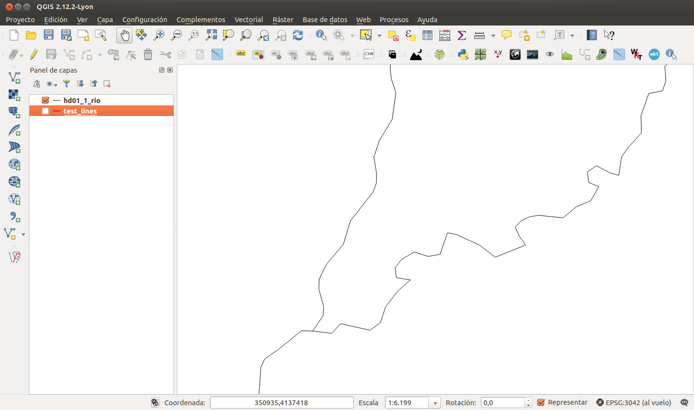
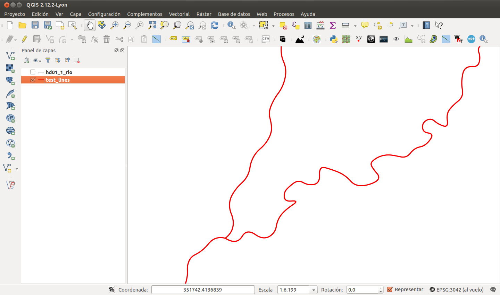
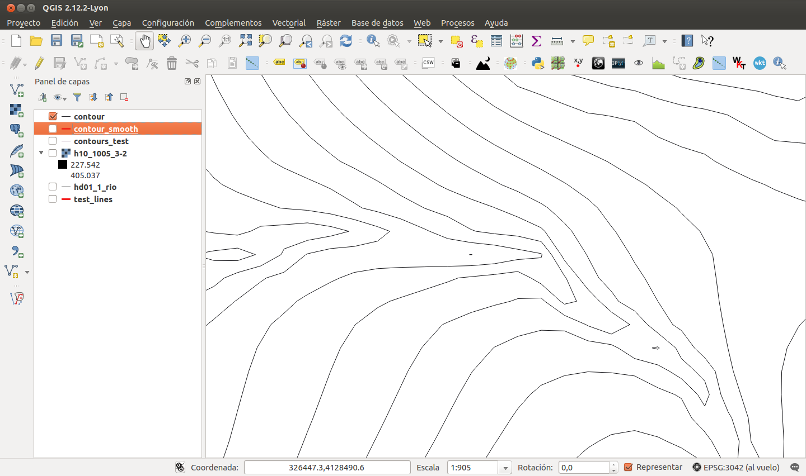
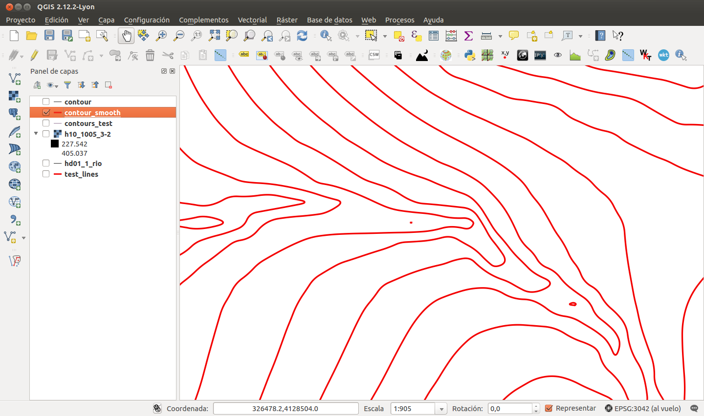

GeoSmoothing
============

Smoothing GIS features with B-Splines.

Input formats are WKT and SHP.

Builded on top of Numpy, Scipy, Shapely and Fiona.

Examples
--------

Example 1. Rivers.
~~~~~~~~~~~~~~~~~~

|Unsmoothed rivers layer.| |Smoothed rivers layer.|

Example 2. DEM contours.
~~~~~~~~~~~~~~~~~~~~~~~~

|Unsmoothed dem contours layer.| |Smoothed dem contours layer.|

Install
-------

::

    $ pip install .

Usage
-----

Command Line
~~~~~~~~~~~~

WKT smoothing:

::

    $ geosmoothing_wkt [-h] wkt_string

    positional arguments:
      wkt_string  Input WKT string to smooth

    optional arguments:
      -h, --help  show this help message and exit

Shapefile smoothing:

::

    $ geosmoothing_shp [-h] src_file dst_file

    positional arguments:
      src_file    source shapefile path
      dst_file    destiny shapefile path

    optional arguments:
      -h, --help  show this help message and exit

Importing module
~~~~~~~~~~~~~~~~

WKT smoothing:

.. code:: python

    from geosmoothing.geosmoothing import GeoSmoothing

    wkt = "LineString (-5.88785025361041292 36.2403008312793915, -5.94918202938661622 36.05017232637315772, -6.01664698274044163 35.81711157842358517, -5.86945072087755193 35.58405083047400552, -5.40946240255602095 35.52271905469780222, -5.09053716851975935 35.61471671836211073, -5.18253483218406608 35.97044101786408987, -5.44012829044412349 36.27096671916749671, -5.34199744920219644 36.61442466351423519, -4.45268670044723791 36.74935457022188245, -4.4710862331800989 35.92137559724312723, -4.37295539193817184 35.58405083047400552, -4.06629651305715178 35.95817466270885632, -3.94976613908236374 36.29549942947797803, -3.47751146560559299 36.32003213978845935, -3.25058389523363722 36.44882886891848273, -3.46524511045035144 36.76162092537712311, -3.17085258672457204 36.88428447692953682)"

    gsm = GeoSmoothing()
    res_wkt = gsm.smoothWkt(wkt)

    print(res_wkt)

Shapefile smoothing:

.. code:: python

    from geosmoothing.geosmoothing import GeoSmoothing

    src_file = "./data/dem_contours/contour.shp"
    dst_file = "/tmp/contour_smt.shp"
    gsm = GeoSmoothing()
    gsm.smoothShp(src_file, dst_file)

Requirements
------------

Python libraries:
~~~~~~~~~~~~~~~~~

-  Numpy: http://www.numpy.org/
-  Scipy: http://scipy.org/scipylib/
-  Shapely: https://github.com/Toblerity/Shapely
-  Fiona: https://github.com/Toblerity/Fiona

Others:
~~~~~~~

-  GDAL library: http://www.gdal.org/
-  GEOS library: https://trac.osgeo.org/geos/

About author
------------

Developed by Cayetano Benavent. GIS Analyst at Geographica.

http://www.geographica.gs

License
-------

This program is free software; you can redistribute it and/or modify it
under the terms of the GNU General Public License as published by the
Free Software Foundation; either version 2 of the License, or (at your
option) any later version.

